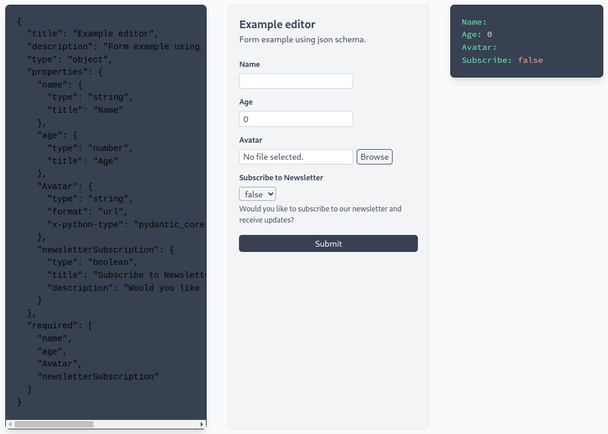

# emerald-json-editor-react

Wrapper around [json-editor](https://github.com/json-editor/json-editor) and react. NB! Does currently not work with next.js projects.



## Install

```
npm install emerald-json-editor-react
```

## Getting Started

### Here is a full [Example Project](https://github.com/emerald-geomodelling/emerald-json-editor-react-example)


```javascript
import React, { useState } from "react";
import { JsonEditorWrapper } from "emerald-json-editor-react";
import schema from "schema.json";

const JsonForm = () => {
  const [data, setData] = useState(undefined);

  return (
    <JsonEditorWrapper
      schema={schema}
      data={data}
      setData={setData}
    />
  );
};
```


## API

### Custom fields

A custonm field is a React component that is responsible for rendering
the input for a particular fragment of the JSON document identified by
matching against the schema (in this case, string properties with a
format of `x-fruit`). You can invent/add extra schema properties for
this purpose, you don't have to reuse the existing ones (like
`format`) as done here. Be careful when registering multiple custom
fields that multiple ones can't match on the same schema; the order
fields are tried in is not well defined.

```javascript
import { registerJsonEditorField } from "emerald-json-editor-react";

const FruitSelector = ({ value, setValue, schema, context }) => {
  return (<div>
    <div><a onClick={() => setValue('Banana'))>{value === "Banana" ? "*" : "-"} Banana</a></div>
    <div><a onClick={() => setValue('Apple'))>{value === "Apple" ? "*" : "-"} Apple</a></div>
    <div><a onClick={() => setValue('Orange'))>{value === "Orange" ? "*" : "-"} Orange</a></div>
  </div>);
};

registerJsonEditorField(
  (schema) => schema.type === "string" && schema["format"] === "x-fruit",
  FruitSelector
);
```

### File uploads

The `importFile` prop of `<JsonEditorWrapper/>` is an optional
function for file upload handling. This is an example of the function
using axios:

```javascript
export const importFile = (file) => {
  const formData = new FormData();
  formData.append("file", file);

  return client.post(`/api/file/new`, formData, {
    headers: {
      "Content-Type": "multipart/form-data",
    },
  });
};
```

The importFile function should return an object (inside a promise)
with a `.data.file` property containing the URL to the uploaded file.


### Validation

The `onValidationStatusChange` prop is an optional function that is used to update a local state based on form validation, for example:

```javascript
const [isDataValid, setIsDataValid] = useState(false);

const onValidationStatusChange = (status) => {
  setIsDataValid(status);
};

<JsonEditorWrapper onValidationStatusChange={onValidationStatusChange}>
```
